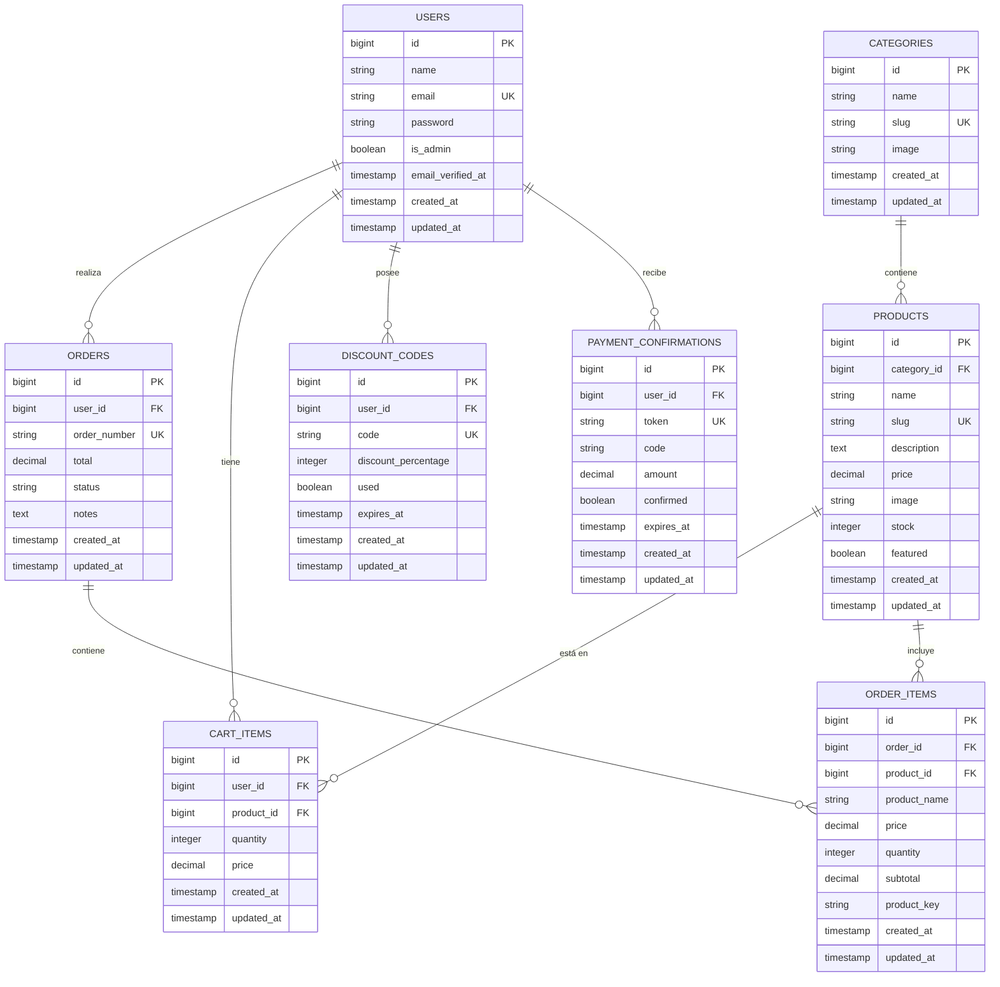

# Documentación del Sistema - eCommerce Laravel

> **Cómo visualizar este documento:**
> - **VS Code:** Presiona `Ctrl+Shift+V` para abrir la vista previa y ver los diagramas renderizados
> - **GitHub:** Los diagramas Mermaid se renderizan automáticamente
> - **Otros editores:** Usa un visor compatible con diagramas Mermaid

## Tabla de Contenidos
- [1. Diagrama Entidad-Relación](#1-diagrama-entidad-relación)
- [2. Diagrama de Casos de Uso](#2-diagrama-de-casos-de-uso)

---

## 1. Diagrama Entidad-Relación

El siguiente diagrama muestra la estructura de la base de datos del sistema de eCommerce, incluyendo todas las entidades y sus relaciones:

### Descripción de las Entidades

#### USERS (Usuarios)
Almacena la información de los usuarios del sistema, tanto clientes como administradores.

#### CATEGORIES (Categorías)
Organiza los productos en diferentes categorías para facilitar la navegación.

#### PRODUCTS (Productos)
Contiene toda la información de los productos disponibles en la tienda.

#### CART_ITEMS (Items del Carrito)
Registra los productos que cada usuario ha agregado a su carrito de compras.

#### ORDERS (Pedidos)
Almacena la información de las órdenes realizadas por los usuarios.

#### ORDER_ITEMS (Items del Pedido)
Detalla los productos incluidos en cada pedido, preservando información del producto al momento de la compra.

#### DISCOUNT_CODES (Códigos de Descuento)
Gestiona códigos promocionales asignados a usuarios para obtener descuentos.

#### PAYMENT_CONFIRMATIONS (Confirmaciones de Pago)
Maneja el proceso de confirmación de pagos mediante códigos de verificación.

### Relaciones Principales

- **Usuario - Pedidos**: Un usuario puede realizar múltiples pedidos (1:N)
- **Usuario - Carrito**: Un usuario tiene múltiples items en su carrito (1:N)
- **Usuario - Códigos de Descuento**: Un usuario puede tener múltiples códigos (1:N)
- **Categoría - Productos**: Una categoría contiene múltiples productos (1:N)
- **Producto - Items del Carrito**: Un producto puede estar en múltiples carritos (1:N)
- **Pedido - Items del Pedido**: Un pedido contiene múltiples items (1:N)
- **Producto - Items del Pedido**: Un producto puede estar en múltiples pedidos (1:N)

---

## 2. Diagrama de Casos de Uso

El siguiente diagrama ilustra las funcionalidades disponibles para cada tipo de actor en el sistema:

```mermaid
graph TB
    subgraph Sistema["Sistema eCommerce Laravel"]
        subgraph Navegación["Navegación y Catálogo"]
            UC1[Ver página de inicio]
            UC2[Explorar productos]
            UC3[Buscar productos]
            UC4[Ver detalle de producto]
            UC5[Filtrar por categoría]
        end
        
        subgraph Autenticación["Gestión de Usuarios"]
            UC6[Registrarse]
            UC7[Iniciar sesión]
            UC8[Cerrar sesión]
        end
        
        subgraph Carrito["Gestión del Carrito"]
            UC9[Ver carrito]
            UC10[Agregar producto al carrito]
            UC11[Actualizar cantidad]
            UC12[Eliminar producto]
            UC13[Vaciar carrito]
        end
        
        subgraph Compras["Proceso de Compra"]
            UC14[Realizar checkout]
            UC15[Aplicar código de descuento]
            UC16[Procesar pago]
            UC17[Pago con Stripe]
            UC18[Confirmar pago con código]
            UC19[Ver estado del pago]
        end
        
        subgraph Pedidos["Gestión de Pedidos"]
            UC20[Ver mis pedidos]
            UC21[Ver detalle de pedido]
        end
        
        subgraph AdminProductos["Administración de Productos"]
            UC22[Listar productos]
            UC23[Crear producto]
            UC24[Editar producto]
            UC25[Eliminar producto]
        end
        
        subgraph AdminUsuarios["Administración de Usuarios"]
            UC26[Gestionar usuarios]
        end
    end
    
    Invitado([Usuario Invitado])
    Cliente([Cliente Autenticado])
    Admin([Administrador])
    
    %% Usuario Invitado
    Invitado --> UC1
    Invitado --> UC2
    Invitado --> UC3
    Invitado --> UC4
    Invitado --> UC5
    Invitado --> UC6
    Invitado --> UC7
    
    %% Cliente Autenticado
    Cliente --> UC1
    Cliente --> UC2
    Cliente --> UC3
    Cliente --> UC4
    Cliente --> UC5
    Cliente --> UC8
    Cliente --> UC9
    Cliente --> UC10
    Cliente --> UC11
    Cliente --> UC12
    Cliente --> UC13
    Cliente --> UC14
    Cliente --> UC15
    Cliente --> UC16
    Cliente --> UC17
    Cliente --> UC18
    Cliente --> UC19
    Cliente --> UC20
    Cliente --> UC21
    
    %% Administrador
    Admin --> UC1
    Admin --> UC2
    Admin --> UC3
    Admin --> UC4
    Admin --> UC5
    Admin --> UC8
    Admin --> UC22
    Admin --> UC23
    Admin --> UC24
    Admin --> UC25
    Admin --> UC26
    
    style Invitado fill:#e1f5ff
    style Cliente fill:#c8e6c9
    style Admin fill:#ffccbc
    style Sistema fill:#f5f5f5
```

### Descripción de Actores

#### 1. Usuario Invitado
Usuario no autenticado que puede navegar por la tienda y visualizar productos.

**Casos de Uso:**
- Ver página de inicio
- Explorar productos
- Buscar productos
- Ver detalle de producto
- Filtrar productos por categoría
- Registrarse en el sistema
- Iniciar sesión

#### 2. Cliente Autenticado
Usuario registrado que ha iniciado sesión y puede realizar compras.

**Casos de Uso:**
- Todos los casos de uso del Usuario Invitado (excepto Registrarse e Iniciar sesión)
- Cerrar sesión
- Ver carrito de compras
- Agregar productos al carrito
- Actualizar cantidad de productos
- Eliminar productos del carrito
- Vaciar carrito completamente
- Realizar checkout
- Aplicar códigos de descuento
- Procesar pagos
- Pagar con tarjeta mediante Stripe
- Confirmar pagos con código de verificación
- Ver estado del pago
- Ver historial de pedidos
- Ver detalle de pedidos realizados

#### 3. Administrador
Usuario con privilegios administrativos para gestionar el sistema.

**Casos de Uso:**
- Todos los casos de uso del Cliente (excepto procesos de compra)
- Listar todos los productos
- Crear nuevos productos
- Editar productos existentes
- Eliminar productos
- Gestionar usuarios del sistema

### Flujos Principales

#### Flujo de Compra
1. El cliente explora productos
2. Agrega productos al carrito
3. Revisa el carrito
4. Procede al checkout
5. Aplica código de descuento (opcional)
6. Procesa el pago (Stripe o confirmación por código)
7. Recibe confirmación del pedido
8. Puede consultar el estado y detalles del pedido

#### Flujo de Administración
1. El administrador inicia sesión
2. Accede al panel de administración
3. Gestiona productos (crear, editar, eliminar)
4. Gestiona usuarios del sistema

---

## Información Adicional

### Tecnologías Utilizadas
- **Framework:** Laravel (PHP)
- **Base de Datos:** MySQL
- **Pasarela de Pago:** Stripe
- **Autenticación:** Laravel Sanctum
- **Frontend:** Blade Templates

### Estados de Pedidos
- **pending:** Pedido pendiente de confirmación
- **processing:** Pedido en procesamiento
- **completed:** Pedido completado
- **cancelled:** Pedido cancelado

### Métodos de Pago
1. **Stripe:** Pago con tarjeta de crédito/débito
2. **Confirmación por Código:** Sistema de códigos de verificación enviados por email

---

**Fecha de Documentación:** Febrero 2026  
**Versión:** 1.0
